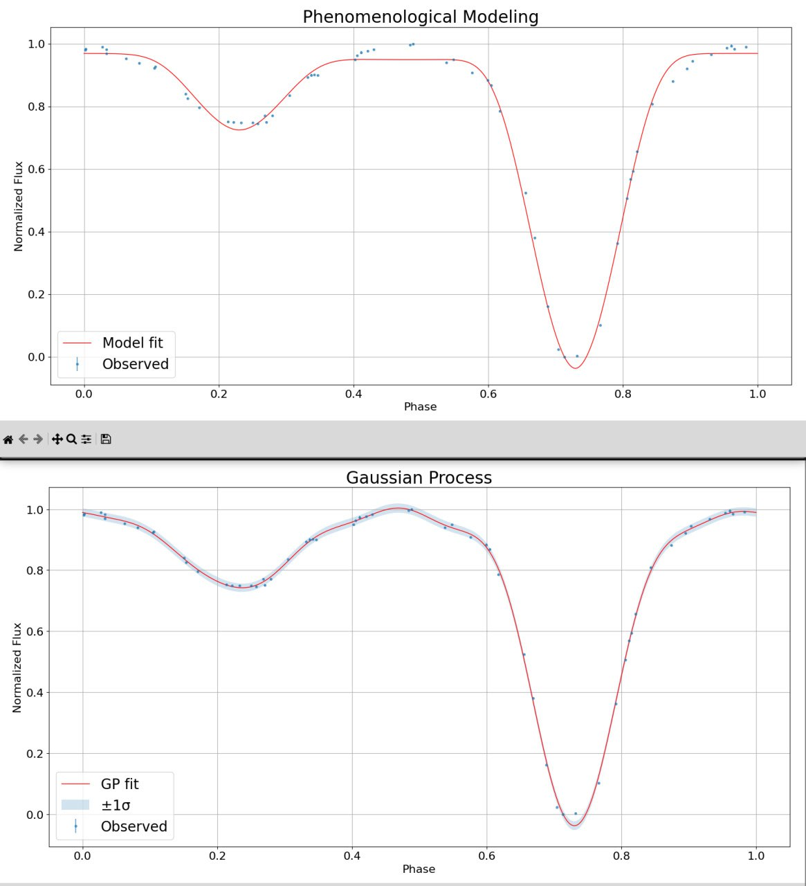
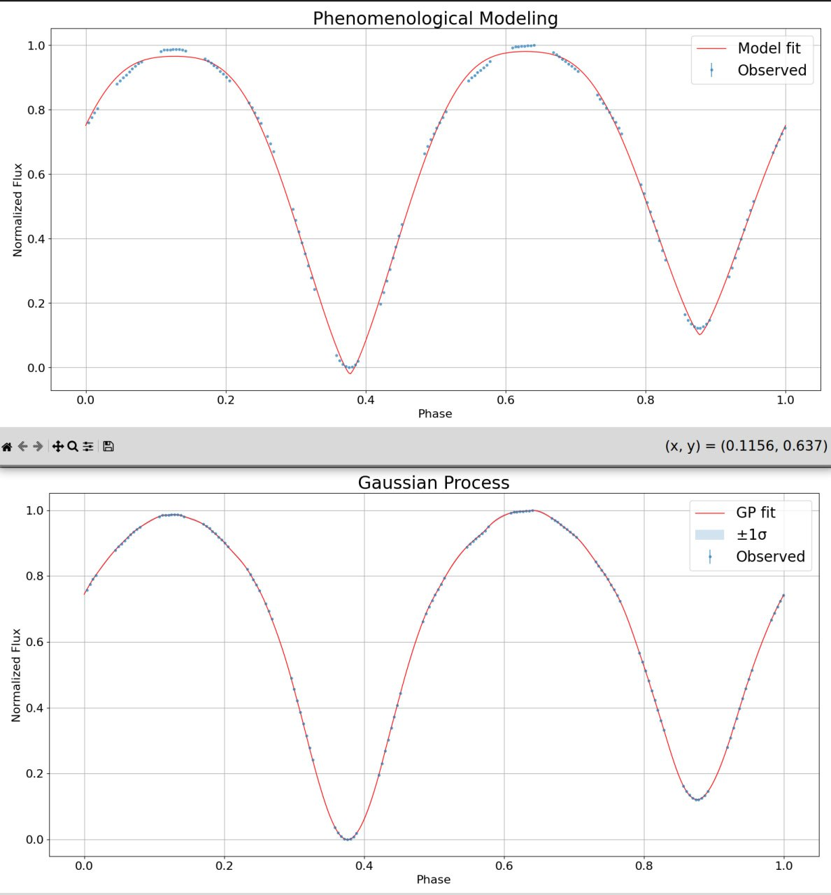

# Phenomenological Modelling of Eclipsing-System Light Curves

This repository contains a **Python implementation of phenomenological modelling of eclipsing-system light curves**, 
following the approach of **Z. Mikulášek** and **based on the original code by Štefan Parimucha**.
For comparison purposes (and partly out of curiosity), **Gaussian Process (GP) fits were also implemented for the same stars**, 
allowing a qualitative comparison between flexible non-parametric modelling and the phenomenological approach. 

## Phenomenological Modelling

#### Model definition

The phased light curve is modelled as a sum of:
1. **Two symmetric eclipse profiles** (primary and secondary)
2. **Low-order harmonic terms** describing out-of-eclipse variability and asymmetry

#### Eclipse component

Each eclipse is described by a Mikulášek-type analytical function.  
In the current implementation, both eclipses share the same width and shape parameters.

**Eclipse parameters:**

| Parameter | Meaning |
|----------|--------|
| `B` | Baseline (out-of-eclipse level) |
| `A1`, `A2` | Depths of primary and secondary eclipses |
| `D` | Eclipse half-width (common for both minima) |
| `Gamma` | Shape (kurtosis) parameter controlling ingress/egress steepness |

#### Harmonic component

Out-of-eclipse variability is modelled using Fourier terms:

- `A_cos₁ … A_cosₙ` — cosine harmonics  
- `A_sin` — optional sine term (for asymmetric light curves)

The number of cosine terms is controlled by `np_terms`.  
The sine term is included when `nc = 1`.

#### Full parameter vector
[phase_shift, B, A1, A2, D, Gamma, A_cos₁ … A_cosₙ, (A_sin)]

### Flux normalisation

Observed fluxes are **linearly normalised to the [0, 1] range** prior to fitting.
Original min/max flux values are retained.

### Fitting strategy

- **Robust non-linear least squares** (`scipy.optimize.least_squares`)
- `soft_l1` loss to reduce sensitivity to outliers
- Explicit lower/upper bounds enforcing physically meaningful solutions
- Goodness of fit evaluated via χ² and reduced χ²

## Gaussian Process Light-Curve Approximation

This part demonstrates the use of **Gaussian Process (GP) regression** to approximate well-sampled, 
phase-folded stellar light curves.

The GP is applied directly in phase space using a **fixed composite kernel** consisting of a Matérn (ν = 3/2), 
periodic (ExpSineSquared), white-noise, and constant components. 
The kernel hyperparameters are adopted from *Trevisan, Piero et al. (2023)*.

To suppress edge effects at phase boundaries, the folded light curve is **repeated** before fitting. 
The GP is then evaluated on a dense, uniformly spaced phase grid. Finally, the interpolated curve 
is **phase-shifted so that the maximum flux occurs at phase 0**.

The result is a smooth, periodic representation of the light curve with associated uncertainty estimates.

## Phenomenological Modelling vs. GP
Here we compare some results visually:

  
  

## Status

This repository is a **draft**.  
The parameterisation, bounds, and fitting strategy may evolve as testing continues.

## References
- Zdenek Mikulášek, "Phenomenological modelling of eclipsing system light curves", A&A 584, A8 (2015)
- Trevisan, P. et al., "Sparse Logistic Regression for RR Lyrae versus Binaries Classification", ApJ, 950, 103 (2023)
